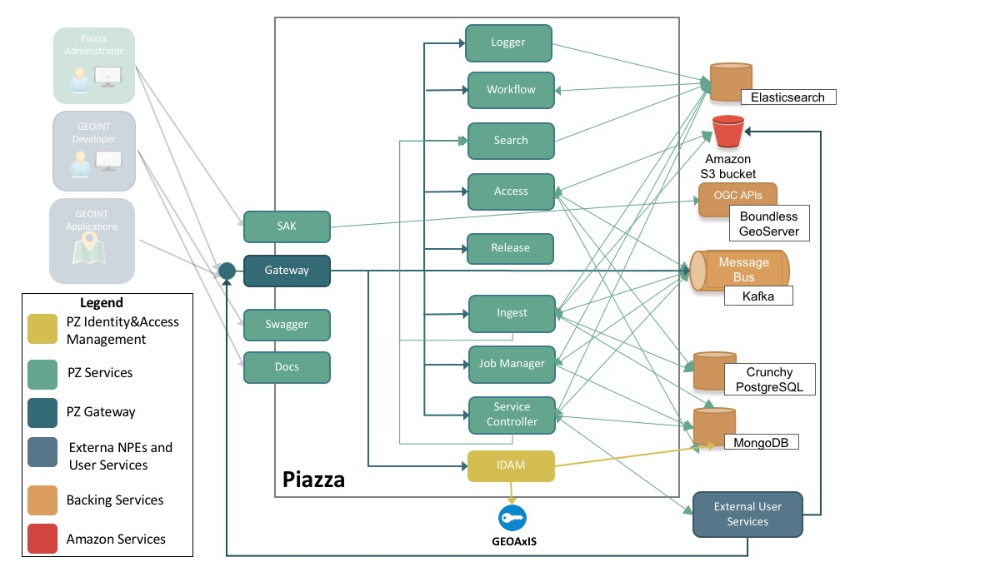

# Piazza Core Overview

The core functionality of Piazza is split up into several internal
components that are shown in the below diagram.

Piazza consists of a set of stateless microservices where core
capabilities are broken up into small independent deployable services.
Stateless microservices treat each request as an independent transaction
and do not rely on previous data or “state” from previous requests. The
Gateway takes the incoming Piazza requests and routes them to the
appropriate services. Figure 2 shows an overview of Piazza’s
microservices and how they interact with each other.

Communication between these microservices is done using two mechanisms.
The primary mechanism is using HTTPS where microservices communicate
directly by initiating requests and receiving responses. The second
mechanism is using asynchronous notifications where communication is
initiated when specific conditions are met. The second mechanism
leverages Apache Kafka message bus and Elasticsearch Triggers to provide
for asynchronous notifications.
